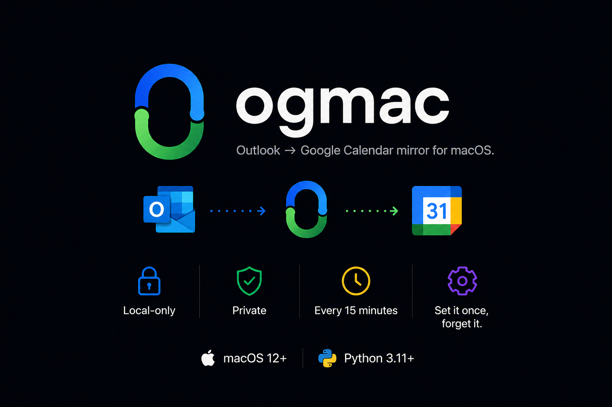
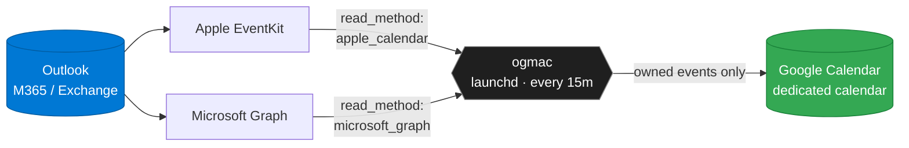

<div align="center">



[](https://github.com/razbahri/ogmac/actions/workflows/test.yml)
[](LICENSE)
[](https://www.python.org/downloads/)
[](https://support.apple.com/macos)
[](#status)

</div>

---

ogmac runs every 15 minutes via macOS `launchd` and mirrors your work Outlook calendar into a dedicated Google Calendar — so your meetings show up wherever you (and the people in your life) actually look. No SaaS bridge, no shared servers, no third-party access tokens. Tokens live in **macOS Keychain**; events go straight to **`googleapis.com`**.

> [!TIP]
> Two interchangeable backends. Use **Apple Calendar (EventKit)** when your tenant blocks third-party Microsoft Graph apps — no Microsoft OAuth required. Use **Microsoft Graph** when you don't want Exchange wired into the OS. Switch any time by editing one config line.

## Quickstart

```bash
git clone https://github.com/razbahri/ogmac.git && cd ogmac
./packaging/install.sh
```

Then:

1. Configure `~/.config/ogmac/config.yaml` — see [docs/setup.md](docs/setup.md).
2. Drop your Google OAuth client at `~/.config/ogmac/client_secret.json`.
3. `ogmac login` and `ogmac sync` to verify.

That's it. From then on, launchd runs `ogmac sync` every 15 minutes in the background.

## Menu bar app

The v0.2 menu bar app (`Ogmac.app`) lives in your macOS menu bar and gives you a live view of sync status, settings, and recent-run history without opening a terminal.

**Install (unsigned build):**

```bash
bash packaging/build_app.sh
open dist/Ogmac.app
```

macOS will block the first launch because the binary is unsigned. Right-click `Ogmac.app` → Open → Open anyway (once). After that it opens normally.

**What it does:**

- Displays a status icon (healthy / warning / error / auto-disabled / paused / syncing) that updates **the moment the daemon writes `state.db`** — no polling. The app installs a `DispatchSource` file-system watcher and refreshes within ~200 ms of each sync completion.
- Panel shows the next scheduled sync time, the most recent meaningful change (`✓ N created · N updated · N del · X min ago`), or "Up to date · checked X min ago" when the last few syncs were no-ops.
- Sync now triggers `ogmac sync` and shows live progress; the button waits for the daemon to finish, no matter how long it takes.
- Settings (Cmd-,) exposes the editable config (Connection / Sync / Privacy tabs); changes save atomically to `~/.config/ogmac/config.yaml` on every field edit.
- History (in-panel `← Back` navigation) lists scheduled and meaningful runs only — the network-change-driven no-op syncs every ~2 min are filtered out.
- Pause and Resume map to `ogmac pause` / `ogmac unpause`; the pause flag persists across reboots.
- Quit closes the menu bar item; **launchd keeps running** on its normal schedule.

**Diagnostic log:** the app writes a structured event log at `~/Library/Logs/ogmac/menubar.log` (separate from the daemon's `sync.log`). Tail it with `tail -f ~/Library/Logs/ogmac/menubar.log` to see refresh and watcher events.

**First launch:** if `ogmac` is not on PATH and not at `~/.local/share/ogmac/venv/bin/ogmac`, the app shows a setup screen with a Copy button for `ogmac login`. Run `./packaging/install.sh` first to install the CLI.

## How it works



ogmac stamps every event it creates with an `ogmac_owned=1` marker and only ever sees its own events on the Google side. User-created events on the target calendar are invisible to it and never touched.

## Documentation

| | |
|---|---|
| 🛠 **[Setup](docs/setup.md)** | Pick a backend, add Exchange to System Settings, create the Google OAuth client, write the config. |
| ⚙️ **[Operations](docs/operations.md)** | `status`, `resume`, `reset`, stop / disable / uninstall, logs. |
| 🧩 **[Architecture](docs/architecture.md)** | Field mapping, identity markers, reconciliation model. |
| 🩺 **[Troubleshooting](docs/troubleshooting.md)** | Permission denials, OAuth dead-ends, launchd silence, token expiry. |
| 🤝 **[Contributing](CONTRIBUTING.md)** | Dev setup, test suite, project layout. |

## Privacy

ogmac copies event **title, time, location, body, availability, and all-day flag** to your Google Calendar. **Attendees are never copied.** Outbound traffic is limited to:

- `googleapis.com` (always)
- `graph.microsoft.com` (only when `read_method: microsoft_graph`)

Refresh tokens are stored exclusively in **macOS Keychain**; nothing sensitive is written to disk in plaintext.

## Status

ogmac is **beta** — it works on the author's machine and others, but the API surface (config schema, CLI flags) may shift before 1.0. Pin a tag if you depend on it. Bug reports welcome via [Issues](https://github.com/razbahri/ogmac/issues).

## Roadmap

A native macOS **menu bar app** is in active development for v0.2 — see `docs/superpowers/specs/2026-05-08-menu-bar-app-design.md`. It exposes status, settings, and recent-run history without replacing the launchd-driven daemon. Until it ships, the CLI is the only interface.

## Out of scope

Two-way sync · multiple calendar pairs · categories / colors / reminders · attachments · multi-user packaging · auto-update · Graph webhooks / push notifications · classic Outlook AppleScript · EWS fallback.

## License

[MIT](LICENSE) © ogmac contributors
